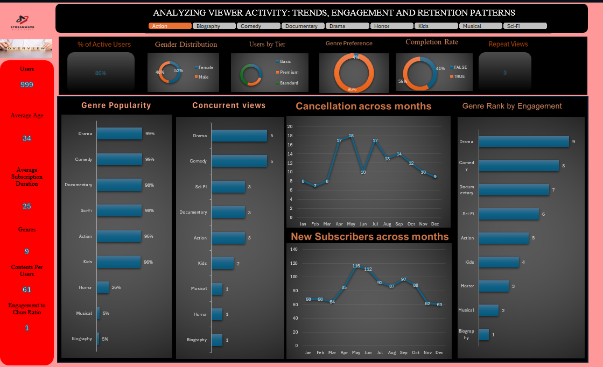

# 📺 Utilizing Viewers' Engagement for Strategic Content Investment in the Media & Entertainment Sector


## 🏢 Company Overview

**StreamWave Entertainment** was founded in 2008 as a DVD rental-by-mail business that pivoted into online streaming as broadband access expanded globally. By 2012, the company had fully transitioned into digital content delivery. In 2015, StreamWave released its first original series — a massive success that established the brand as a serious content creator.

Today, StreamWave is one of the leading subscription-based streaming platforms, offering thousands of titles across drama, comedy, action, sci-fi, documentaries, and kids' entertainment, with over **150 million subscribers across 190+ countries**.

### Notable Milestones
| Year | Milestone |
|------|-----------|
| 2010 | Launched streaming platform in the U.S. |
| 2013 | Expanded internationally across North and South America |
| 2015 | Released first original series, driving a surge in subscriptions |
| 2018 | Introduced AI-driven recommendation engines |
| 2022 | Ranked among the top three global streaming providers by market share |

---

## ❗ Business Challenge

While StreamWave has seen tremendous growth, competition in the streaming sector has intensified. The company's content library is massive, but promotional spending and production budgets are finite. Executives are under pressure to ensure investments are allocated to the right genres that drive **engagement, retention, and subscriber growth**.

**Key obstacles include:**
- **Fragmented Viewership** — Users are spread across dozens of genres, making it difficult to identify which ones truly sustain engagement.
- **Rising Content Costs** — High production and licensing costs require sharper focus on ROI per genre.
- **Churn Concerns** — Some subscribers leave due to lack of appealing recommendations, signaling mismatches between content and user preferences.
- **Competitive Pressure** — Rivals are narrowing in on niche genres (e.g., anime, true crime documentaries) to capture targeted audiences.

---

## 🎯 Project Objectives

1. Analyze total viewing hours by genre across a defined period.
2. Determine average engagement (episodes or movies completed) per genre.
3. Rank genres by repeat viewership and subscriber retention impact.
4. Identify underperforming genres to reduce marketing or production spend.
5. Provide actionable recommendations to executives for future investments and campaign targeting.

---

## 🛠️ Tools Used

- **Microsoft Excel** — Data cleaning, analysis, pivot tables, and dashboard creation

---

## 📂 Dataset

The analysis is based on four datasets:

| Dataset | Description |
|---------|-------------|
| `movie_list` | Catalogue of all available titles and their genre classifications |
| `subscriptions` | Subscription records including plan type, start and end dates |
| `users` | Subscriber demographics and account information |
| `viewing_activity` | Detailed logs of what users watched, when, and for how long |

> **Note:** All datasets used in this project are sample/anonymised data for analytical purposes only.

---

## 📊 Dashboard Preview




---

## 💡 Key Findings & Recommendations
- **Total Users: 999 subscribers with an average age of 34, average subscription duration of 25 months, and 61 contents consumed per user**
- **Active Users: 86% of subscribers are actively engaging with the platform**
- **Gender Distribution: Nearly balanced — Female (52%) slightly outnumbering Male (48%)**
- **Subscription Tiers: Premium subscribers make up the majority, with Basic and Standard representing smaller shares**
- **Genre Preference: 96% of users favour Premium content, with only 4% opting for basic titles**
- **Completion Rate: 59% of content is completed, while 41% is left unfinished — indicating a drop-off problem**
- **Repeat Views: Average of 3 repeat views per user, suggesting moderate content loyalty**
- **Engagement to Churn Ratio: Ratio of 1, signalling a critical balance between engagement and subscriber loss**
- **Top Genres by Popularity: Drama (99%), Comedy (99%), Documentary (98%), and Sci-Fi (98%) dominate, while Horror (26%), Musical (6%), and Biography (5%) significantly underperform**
- **Concurrent Views: Drama and Comedy lead with 5 concurrent views each, while Biography and Horror trail at 1**
- **Genre Rank by Engagement: Drama ranks 1st (score 9), followed by Comedy (8) and Documentary (7); Biography ranks last (1)**

### Recommendations to Executives
1. Double Down on Drama, Comedy, and Documentary — These genres consistently top popularity, engagement, and concurrent views; increasing original content investment here will drive the highest ROI.
2. Address the Completion Rate Gap — With 41% of content going unfinished, introduce autoplay features, personalised recommendations, and shorter content formats to improve completion.
3. Investigate Mid-Year Churn — The spike in cancellations in May–June despite high new subscriber numbers signals a retention problem; consider introducing loyalty rewards or mid-year promotional offers.
4. Revive or Cut Underperforming Genres — Horror, Musical, and Biography show very low popularity and engagement; either reduce investment in these or reposition them with niche marketing campaigns.
5. Tackle End-of-Year Subscriber Decline — New subscriber numbers drop sharply from July to December; launch targeted year-end campaigns and promotions to counteract seasonal drop-off.
6. Leverage the 34 Average Age Demographic — Marketing and content strategies should be tailored to the preferences of the 30–40 age group who make up the core audience.

---

## 📁 Repository Structure

```
streamwave-engagement-analysis/
│
├── README.md
├── dashboard/
│   └── streamwave_dashboard.png     ← Screenshot of Excel dashboard
├── data/
│   ├── movie_list.csv
│   ├── subscriptions.csv
│   ├── users.csv
│   └── viewing_activity.csv
└── workbook/
    └── streamwave_analysis.xlsx     ← Main Excel analysis file
```

---

## 👤 Author

**Adewoye Oluwatimilehin Joseph**
[LinkedIn Profile](https://www.linkedin.com/in/adewoye-oluwatimilehin/)
